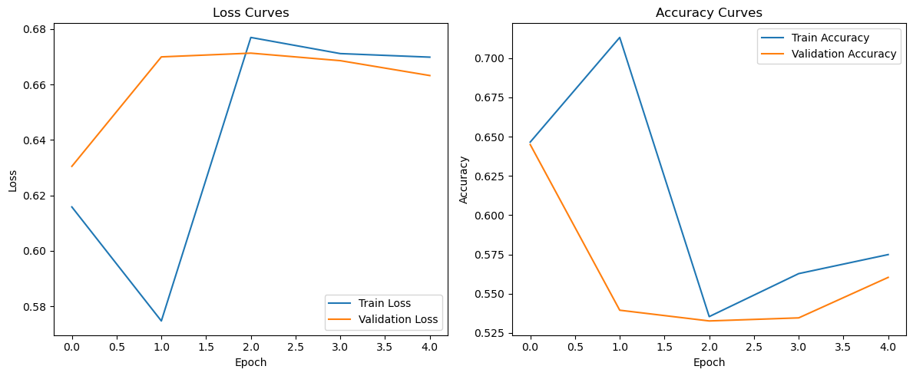

# Fake News Detection with PyTorch

This project implements a **Fake News Detection model using PyTorch and LSTM** on a news article dataset.

The system classifies news articles as **Fake or Real** using deep learning techniques for Natural Language Processing (NLP).

---

## Project Overview

The project demonstrates a complete NLP pipeline including:

* Text preprocessing and cleaning
* Tokenization and vocabulary construction
* Sequence encoding and padding
* LSTM-based deep learning model
* Model training and validation
* Model evaluation and prediction

---

## Model Architecture

The deep learning model includes:

* Embedding Layer
* LSTM Layer
* Dropout Regularization
* Fully Connected Output Layer

The model is trained to perform **binary classification** on news article text.

---

## Training Results

Below are the training curves for **loss and accuracy** during training:



---

## Technologies Used

* Python
* PyTorch
* Pandas
* NumPy
* Scikit-learn
* Matplotlib
* Jupyter Notebook

---

## How to Run the Project

Install the required libraries:

```
pip install -r requirements.txt
```

Then run the notebook:

```
jupyter notebook
```

Open:

```
Fake_News_Detection.ipynb
```

and execute the cells sequentially.

---

## Output

The model predicts whether a news article is **Fake or Real**.

Example:

```
Breaking news: miracle cure discovered...
Prediction: Fake
```

---

## Author

AI / Machine Learning enthusiast focused on NLP and Deep Learning applications.


## Repository Structure

Fake_News_Detection.ipynb – training and evaluation notebook  
best_fake_news_lstm.pth – trained LSTM model  
fake_news_training_curves.png – training results visualization  
requirements.txt – required Python libraries
